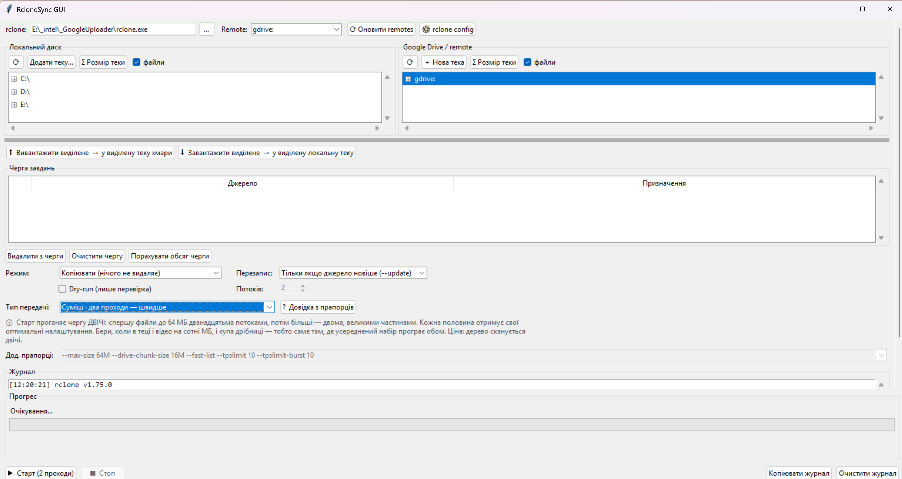

# RcloneSync GUI

Візуальна оболонка над [rclone](https://rclone.org) для Google Drive: два дерева
поруч, черга завдань, прогрес у реальному часі, вивантаження і завантаження.
Python + tkinter, без жодних pip-залежностей.



## Що потрібно

* Python 3.9+ з tkinter (у стандартному інсталяторі Windows він уже є)
* rclone — **у репозиторії його немає**, це 85 МБ стороннього бінарника

## Встановлення rclone

Програма шукає його в такому порядку: поруч зі скриптом → у `PATH` →
у типових теках встановлення. Тож підійде будь-який варіант:

```
winget install Rclone.Rclone
```

або портативно — завантажити zip з [rclone.org/downloads](https://rclone.org/downloads/),
витягнути `rclone.exe` у теку зі скриптом. Тоді нічого налаштовувати не треба,
програма підхопить його сама.

Варто звірити контрольну суму завантаженого архіву з `SHA256SUMS` на сайті.

## Авторизація в Google Drive

Разова процедура, робиться **до** першого запуску програми:

```
rclone config
```

Відповіді майстра: `n` → ім'я `gdrive` → storage `drive` → `client_id` і
`client_secret` порожні → scope `1` (повний доступ) → `service_account_file`
порожньо → advanced `n` → auto config `y`.

Відкриється браузер: обрати акаунт → **Advanced** → **Go to rclone (unsafe)** →
дозволити. Рядок `Waiting for code...` у консолі можна ігнорувати — rclone
отримає код сам, через локальний вебсервер на `127.0.0.1:53682`. Далі `n`
(не Shared Drive) → `y` → `q`.

Перевірка: `rclone lsd gdrive:` має показати список тек з Drive.

Токен лягає в `rclone.conf` (шлях покаже `rclone config file`). **Це ключ від
акаунта — його не можна публікувати чи класти в репозиторій.** Він уже
в `.gitignore`.

> Спільний `client_id` rclone виводять з експлуатації протягом 2026 року.
> Щоб заливки не перестали працювати, варто завести власний:
> [rclone.org/drive/#making-your-own-client-id](https://rclone.org/drive/#making-your-own-client-id).
> Тип клієнта — **Desktop app**, а екран згоди обов'язково треба **Publish**,
> інакше Google анулюватиме токен кожні 7 днів.

## Запуск

```
python Rclone_sync_gui.py
```

## Як користуватись

1. Зліва виділити файли/теки (Ctrl+клік — кілька)
2. Справа виділити **батьківську** теку призначення
3. **⬆ Вивантажити** — пара потрапляє в чергу
4. **▶ Старт**

Крок 3 нічого не передає, він лише ставить у чергу. Передачу запускає Старт.

Колонка «Призначення» показує підсумковий шлях — варто з нею звірятися. Якщо
виділити справа теку з тією ж назвою, що й джерело, вийде вкладений дубль
(`_BOOKS/BOOKS/BOOKS`); треба виділяти батьківську.

Перший запуск краще лишати з увімкненим **Dry-run** — він покаже, що буде
зроблено, без жодних змін. Особливо перед режимом `sync`.

### Тип передачі

Розмір файлів визначає, які налаштування дадуть кращу швидкість. Поріг —
8 МіБ: дрібніші файли йдуть одним запитом, більші ріжуться на частини по
`--drive-chunk-size`, і кожна частина це окремий запит до API.

| Тип передачі | Потоків | Для чого |
|---|---|---|
| Великі файли (100 МБ – 1 ГБ) | 2 | великі частини, менше запитів на файл |
| Дрібні файли (до кількох МБ) | 12 | вузьке місце — API, рятує паралелізм |
| Суміш · один прохід — простіше | 4 | усереднений набір, черга проходить раз |
| Суміш · два проходи — швидше | — | Старт сам проганяє чергу двічі |
| Окремо · тільки дрібні (≤64 МБ) | 12 | половина від «двох проходів», окремо |
| Окремо · тільки великі (≥64 МБ) | 2 | друга половина, окремо |

### Яку із двох сумішей брати

| | один прохід | два проходи |
|---|---|---|
| Файли схожі за розміром | ✔ | зайве |
| І відео на сотні МБ, і купа дрібниці | програє | ✔ |
| Дуже багато файлів у дереві | ✔ | дерево сканується двічі |
| Невелика разова передача | ✔ | різниці не помітно |

Коротко: два проходи виграють там, де розкид розмірів великий і є що
передавати. Якщо ж у теці десятки тисяч файлів, подвійне сканування з'їсть
більше, ніж дасть оптимізація — тоді один прохід.

Тип передачі виставляє і прапорці, і кількість потоків. Під списком
з'являється пояснення, а кнопка **? Довідка з прапорців** відкриває опис
самих ключів.

На теках зі змішаним вмістом два проходи помітно швидші за один. Прапорці
й кількість потоків спільні на всю чергу, тому один запуск не може мати різні
налаштування для різних файлів — потрібні саме два проходи.

Робити це вручну не обов'язково. Тип **«Суміш · два проходи — швидше»**
бере це на себе: черга складається один раз, далі Старт — і програма сама
проганяє її двічі з потрібними налаштуваннями. Кнопка при цьому підписана
`▶ Старт (2 проходи)`, а поля прапорців і потоків вимкнені, бо їх задають
самі проходи.

У рядку прогресу видно, який прохід іде:

```
[2/4] прохід 2 · великі ⬆ E:\Фото → gdrive:Backup/Фото
```

Лічильник рахує сумарно: два завдання в черзі × два проходи = `/4`.

Якщо потрібен контроль між проходами або лише одна їх половина — ті самі
проходи є в списку як **«Окремо · тільки дрібні»** і **«Окремо · тільки
великі»**. Порядок неважливий, фільтри за розміром самі відберуть потрібне.

Поле «Дод. прапорці» лишається вільним: тип передачі його лише заповнює,
а далі його можна правити вручну під конкретний випадок.

### Дрібниці

* `Σ Розмір теки` — рахує розмір виділеної теки на вимогу (Drive не віддає його
  у списку, потрібен рекурсивний обхід)
* `⟳` або **F5** — перечитати виділену теку, не згортаючи дерево
* сіра смужка під деревами тягнеться мишею, уся форма прокручується
* розмір вікна, висота дерев і положення роздільника запам'ятовуються
* журнал копіюється: Ctrl+C, Ctrl+A, права кнопка або окрема кнопка внизу
* Ctrl+C/V/X/A працюють і на кириличній розкладці
* теки, де в назві є `\`, rclone на Windows відкрити не може — програма
  скаже про це одразу, такі теки треба перейменувати в Google Drive

### Режими

| Режим | Дія |
|---|---|
| `copy` | додає й оновлює, нічого не видаляє |
| `sync` | дзеркало — **видаляє** в призначенні все, чого немає в джерелі |
| `move` | переносить і видаляє джерело |

Налаштування зберігаються в `%APPDATA%\RcloneSyncGUI\settings.json`.
Якщо розташування панелей колись зіб'ється — цей файл можна видалити.
